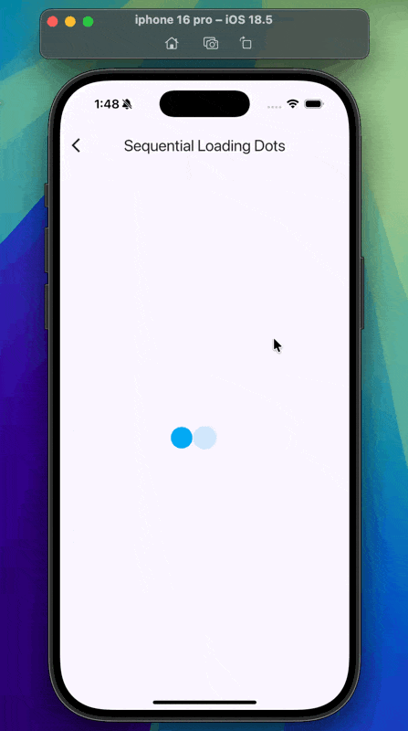

# 🔵 Sequential Loading Dots

An elegant **Flutter animation project** that showcases a sequential loading effect with bouncing and fading dots.  
This project demonstrates how to use **AnimationController**, **TweenSequence**, **ScaleTransition**, and **FadeTransition** together to create smooth, looping animations.

---

## 📸 Demo



---

## 🚀 Features

- ⏳ **Sequential Loading Animation**  
  - Three dots animate one after another, creating a flowing loading effect.  

- 🎨 **Smooth Scaling**  
  - Dots grow quickly, then settle back using `TweenSequence` with easing curves.  

- 🌟 **Opacity Transitions**  
  - Dots fade in and hold steady before looping again.  

- 🔄 **Continuous Loop**  
  - `AnimationController` repeats endlessly for a seamless loading effect.  

- 🧩 **Clean UI**  
  - Minimal and modern design with a light background.  

---

## 🏗️ Project Structure

sequential_loading_dots/
├── lib/
│   ├── main.dart        # App entry point
│   └── home_view.dart   # Animation logic & UI
├── screenshots/
│   └── demo.gif         # Project demo animation
├── test/
│   └── widget_test.dart # Default Flutter test
├── android/             # Android platform code
├── ios/                 # iOS platform code
├── web/                 # Web platform code
├── windows/             # Windows platform code
├── macos/               # macOS platform code
├── linux/               # Linux platform code
├── pubspec.yaml         # Dependencies & assets configuration
└── README.md            # Project documentation

---

## 🛠️ Code Overview

### `main.dart`

Sets up the app and loads the **HomeView**.

```dart
void main() {
  runApp(const SequentialLoadingDots());
}

home_view.dart

Implements the loading dots with:
 • AnimationController for controlling timing
 • TweenSequence for smooth scale and opacity changes
 • ScaleTransition + FadeTransition for visual effects
 • _buildDot() to render each animated dot

⸻

📦 Dependencies

This project uses only Flutter core libraries.
No external packages are required.

⸻

▶️ Getting Started

1️⃣ Clone the repository

git clone https://github.com/Riyam224/Sequential-Loading-Dots---AnimationController-and-Multiple-Tween.git
cd Sequential-Loading-Dots---AnimationController-and-Multiple-Tween

2️⃣ Install dependencies

flutter pub get

3️⃣ Run the app

flutter run


⸻

🎯 Learning Outcomes

By exploring this project, you’ll learn:
 • How to use AnimationController with vsync
 • How to sequence animations using TweenSequence
 • How to animate scaling and opacity together
 • How to create smooth looping animations in Flutter

⸻

🤝 Contributing

Feel free to fork this repo, experiment with different animations (colors, shapes, timing), and submit pull requests! 🚀

⸻


